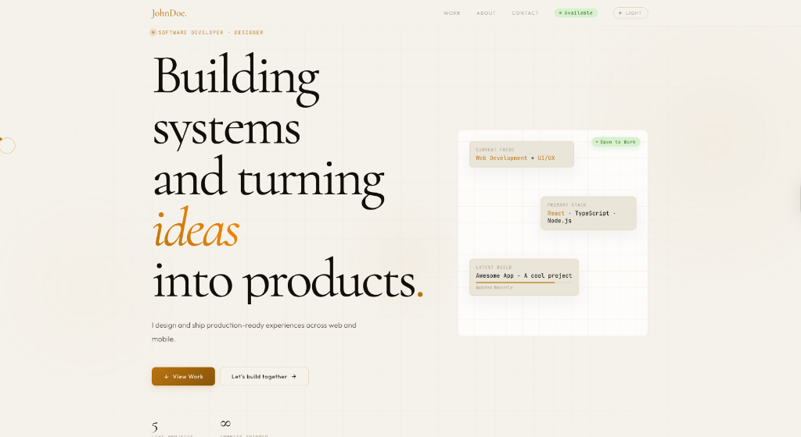
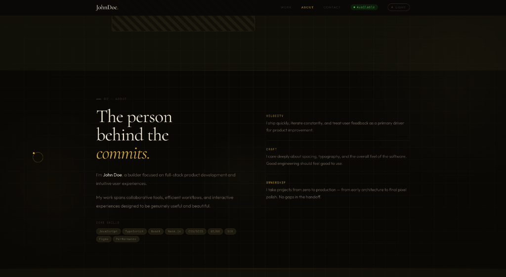
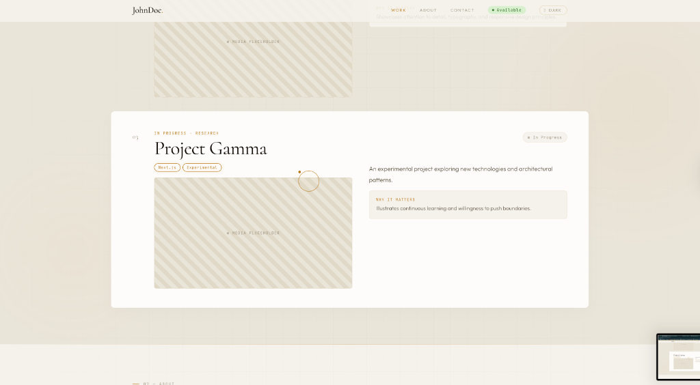

<div align="center">
  
  
  
</div>

<br />

<div align="center">
  <h1 align="center">Premium Developer Portfolio Template</h1>
  <p align="center">
    A highly polished, 60fps hardware-accelerated portfolio template built with Vanilla JS, GSAP, and Vite.
    <br />
    <br />
    <a href="#features"><strong>Explore Features »</strong></a>
    <br />
    <br />
    <a href="#getting-started">Getting Started</a>
    ·
    <a href="#customization">Customization</a>
    ·
    <a href="#technologies-used">Tech Stack</a>
  </p>
</div>

---

## ✦ Overview

This portfolio template is designed for developers, designers, and creative professionals who want a premium, high-performance web presence without relying on heavy frameworks like React or Next.js. 

It focuses on **Micro-interactions**, **Typography**, and **Smooth Scrolling** to create an engaging experience that runs buttery smooth on all devices.

<br />

<div align="center">
  
  
  
</div>

---

## ✨ Features

- **Blazing Fast Performance:** No virtual DOM overhead. Pure HTML, CSS, and modular Vanilla JS powered by Vite.
- **Hardware-Accelerated UI:** All blurs, gradients, and animations are strictly bound to the GPU using `transform: translateZ(0)`.
- **GSAP Animations:** Premium scroll-triggered animations and stagger reveals.
- **Lenis Smooth Scrolling:** Custom interpolation configured for a hyper-realistic, responsive scroll feel.
- **Magnetic Custom Cursor:** An interactive cursor ring that dynamically snaps to clickable elements.
- **Dark / Light Mode:** A fully robust theme toggler with customized OLED-dark and glassmorphism-light palettes.
- **Zero Layout Thrashing:** Carefully optimized JavaScript event listeners and `IntersectionObservers` to guarantee 60fps scrolling.
- **Dynamic Backgrounds:** A seamless, CSS-only moving technical grid background.

---

## 🛠 Technologies Used

- **Core:** HTML5, Modular Vanilla JavaScript
- **Styling:** Vanilla CSS (CSS Variables, Flexbox, CSS Grid)
- **Animation:** [GSAP 3](https://greensock.com/gsap/) & ScrollTrigger
- **Scrolling:** [Lenis](https://lenis.studiofreight.com/)
- **Bundler:** [Vite](https://vitejs.dev/)

---

## 🚀 Getting Started

To get a local copy up and running, follow these simple steps:

### Prerequisites

Ensure you have Node.js and npm installed on your machine.

### Installation

1. **Clone the repository**
   ```sh
   git clone https://github.com/agam263/-Protfolio-Templet-.git
   ```

2. **Navigate into the project directory**
   ```sh
   cd -Protfolio-Templet-
   ```

3. **Install dependencies**
   ```sh
   npm install
   ```

4. **Start the development server**
   ```sh
   npm run dev
   ```
   The site will open locally at `http://localhost:5173`.

---

## 🎨 Customization

The template is highly modular. Here is how you can customize it:

- **Global Styles:** All primary colors, fonts, and theme variables are located at the top of `styles/style.css`.
- **Content:** Navigate to the `components/` directory (e.g., `Hero.js`, `Projects.js`, `About.js`) to edit text, images, and project data.
- **Animations:** All GSAP timelines and Lenis configurations are isolated within `scripts/animations.js`.

---

## 📜 License

Distributed under the MIT License. See `LICENSE` for more information.

---

<div align="center">
  <p>Built with ❤️ by Agam Kundu</p>
</div>
